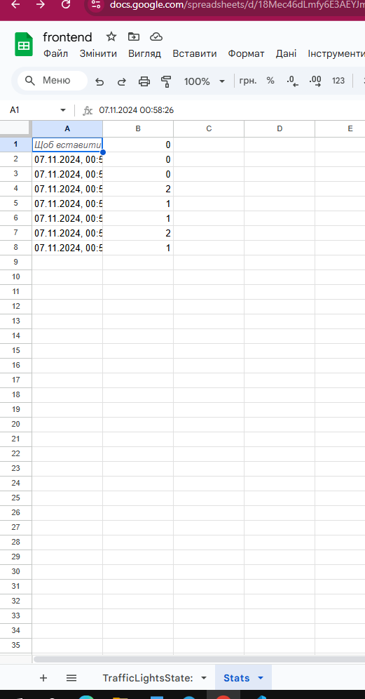

1. Розширила існуючий проєкт "Світлофор", який був створений під час семестрової роботи, додавши компонент "Пішохідний світлофор". 

2. Створила новий компонент PedestrianTrafficLight, який буде відображати два стани: "Чекай" (червоне світло) та "Йди" (зелене світло).

3. Забезпечила синхронізацію між автомобільним та пішохідним світлофорами.

4. Оновила UI так, щоб він візуально представляв обидва світлофори (автомобільний і пішохідний).
https://drive.google.com/drive/folders/1Zki98NiEjHt1b-0mOMpb9wgooh4T3b8O?usp=sharing

5. Реалізувала можливість роботи з сервером.
https://docs.google.com/spreadsheets/d/18Mec46dLmfy6E3AEYJmt8a7Tr4fuiPH3dG3yRdEDM3c/edit?usp=sharing

6. Опублікувати проєкт.
https://exam8frontend.netlify.app
7. Запушила роботу.